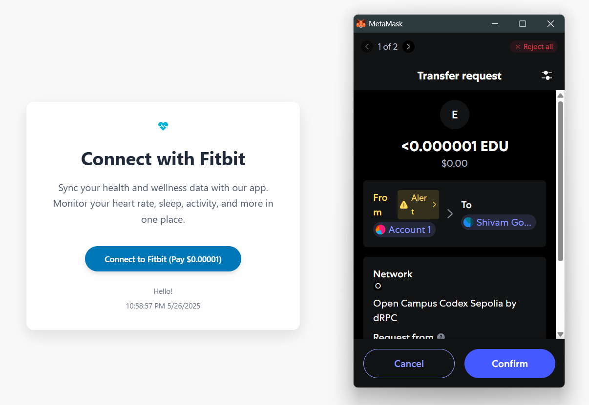
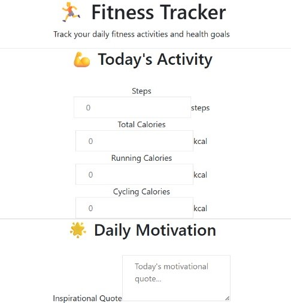
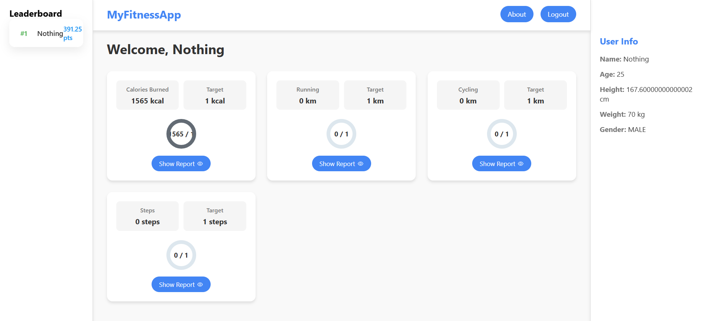
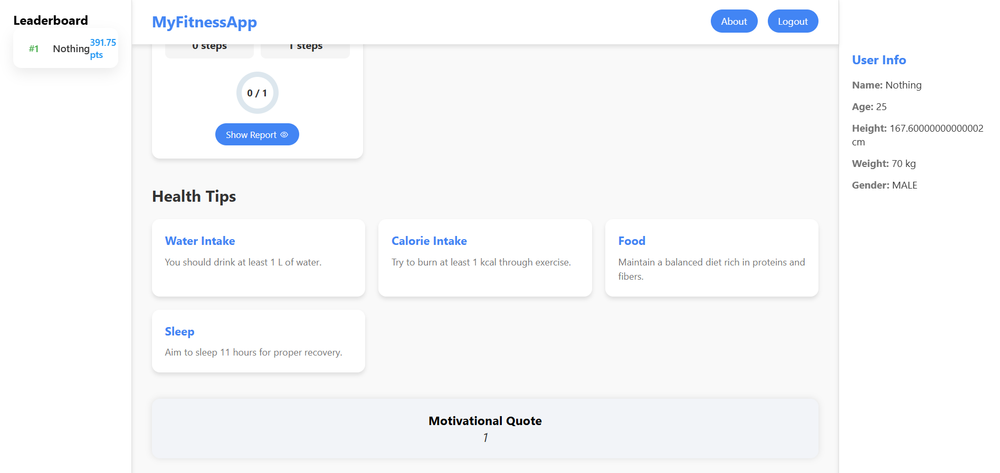

# Health-Hustle 🏃‍♂️💪


Health-Hustle is a full-stack fitness tracking dashboard that uses the Fitbit API to track and display personal fitness information in an interactive and fun manner. It supports progress tracking, health advice, leaderboard challenges, and a responsive user interface.

---

## 📑 Table of Contents

- [Introduction](#introduction)
- [Tech Stack](#tech-stack)
- [Functioning of Model](#functioning-of-model)
- [Features](#features)
- [Quick Start](#quick-start)
- [Snippets](#snippets)
- [Links](#links)
- [More](#more)

---

## 📌 Introduction

Health-Hustle is designed to help users visualize their fitness metrics using Fitbit's data, track daily goals, and participate in leaderboard-based motivation challenges. Whether you're a fitness enthusiast or just starting out, this app makes staying on track easier and more fun.

### 🔐 User Login System



There are two ways to log in to our application: admin and user. Fitbit is used to authenticate users when they log in, giving us access to real-time fitness data like steps taken, calories burned, sleep duration, and more. The user must then finish a blockchain-based payment to guarantee safe and transparent transactions.

Following successful payment and authentication, the system examines the user's Fitbit data and automatically places them in a particular fitness group according to their activity levels and health indicators. By promoting goal-oriented fitness progress and community involvement, this group-based assignment helps customize the user experience.


### 👤 Admin Role



Administrators are chosen using a specific registration form that evaluates their knowledge and proficiency in wellness, nutrition, or fitness. Following approval, each administrator is tasked with managing one or more user groups that best fit their background and skill set.

Among the administrator's primary duties are:

Creating Daily Challenges: To keep users interested and motivated, administrators create and update daily fitness challenges specific to the groups they are assigned.

Sharing Inspirational Quotes: Administrators post inspirational quotes every day to raise spirits and promote a positive outlook.

In order to maximize users' overall fitness journey, administrators provide customized guidance on food selection, hydration, and other wellness factors based on the health data and progress of users within their groups.

Crucially, the administrator's pay is securely handled through blockchain payments, guaranteeing prompt, transparent, and verifiable payment for their services.

With the use of blockchain technology, this framework enables administrators to play a crucial part in helping users reach their fitness objectives while upholding accountability and transparency.

### 🔗 Group Info



Group Assignment and Competitive Elements:

Once a user is authenticated through Fitbit and makes the blockchain payment, he/she gets assigned to a fitness group based on his/her actual-time health and activity metrics. This is done by matching the user's daily statistics—steps walked, calories burned, etc., and other fitness parameters of interest—to preset group target goals set by the admin for each group.

Each user is rewarded points based on the extent to which they achieve or exceed these target levels. For instance, if a user exceeds their daily step goal or their calorie burn target, they gain more points. The point system encourages motivation through rewarding steady progress and good behavior.

The site has a live leaderboard, displaying the rankings of users in each group according to the points they have accumulated. It presents a sense of friendly rivalry, motivating users to work even harder and succeed at their fitness goals more eagerly. Users are able to check their positions every day, so the experience is interactive and goal-oriented.



Also, the admin feature comes with the privilege of offering customized wellness recommendations to individual or group users. These recommendations address key health aspects such as:

Water Intake: Hydration guidelines depending on activity level.

Food Intake: Calorie intake and healthy meal options advice.

Sleep Duration: Advice to maximize rest and recovery for enhanced performance.

By integrating data-driven group allocation, gamified competition, and professional wellness tips, the platform makes a comprehensive, interactive fitness ecosystem that helps users achieve their health objectives efficiently. goal-driven fitness improvement and social interaction.

---

## 🧰 Tech Stack

- **Frontend**: React.js, CSS
- **Backend**: Node.js, Express.js
- **OAuth Integration**: Fitbit OAuth2
- **Database**: MongoDB
- **Version Control**: Git + GitHub

---

## ⚙️ Functioning of Model

1. **OAuth Authorization**: Users authenticate with Fitbit using OAuth2.
2. **Data Fetching**: Access tokens are used to fetch step counts, heart rate, calories, etc.
3. **Data Display**: Stats are shown via React components with progress indicators.
4. **Leaderboard Logic**: Users are compared on key metrics for ranking.
5. **Health Tips Engine**: Based on metrics, users get personalized health suggestions.

---

## ✨ Features

- 🚶 Step counter with circular progress
- 🔐 Fitbit OAuth authentication
- 🏆 Leaderboard and challenges
- 🩺 Health tips based on live metrics

---

## ⚡ Quick Start

```bash
# Clone the repo
git clone https://github.com/Shivamgoyal5/Health-Hustle.git

# Navigate to client and install dependencies
cd fitbit-client-main/client
npm install

# Navigate to server and install dependencies
cd ../../server
npm install

# Create .env files for client and server with your Fitbit credentials

# Start the development servers
# In client folder
npm start

# In server folder
node index.js
